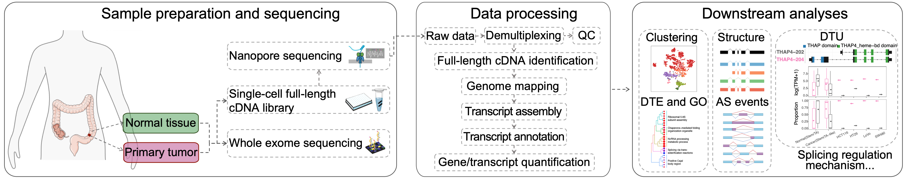

# 🧬 CRC_SCANseq

This repository contains workflows and code developed for the CRC SCAN-seq project, which applies long-read single-cell RNA sequencing (SCAN-seq) to profile isoform complexities and somatic mutation impact in colorectal cancer.

## 📁 Repository Structure

### ./SCANseq_workflow

A Snakemake workflow for preprocessing SCAN-seq data. It mainly includes:

- Demultiplexing of raw reads
- Identification of full-length cDNA reads
- Genome alignment
- Transcript assembly and annotation
- Gene and transcript-level quantification

### ./WES_workflow

A Snakemake pipeline for processing whole-exome sequencing (WES) data using GATK4 to identify somatic mutations.

### ./Downstream_analysis

Scripts for downstream analyses of long-read scRNA-seq data in colorectal cancer. Key analyses include:

- Quality control metrics
- Isoform-level cell clustering and cell type annotation
- Inference of copy number variation (CNV) from RNA
- Estimation of 3’-UTR length deviation
- Differential transcript usage (DTU)
- Differential CDS (coding sequence) usage
- Alternative splicing analysis
- Somatic mutation expression analysis

## 📦 Requirements

The project uses environment management for reproducibility and modularity. Please set up the following environments before running the workflows:

- **SCAN-seq workflow**:
    - SCANseq_workflow/SCANseq_environment.yaml
    - *Conda environment for long-read single-cell RNA-seq preprocessing.*
- **WES workflow**:
    - WES_workflow/WES_environment.yaml
    - *Conda environment for whole-exome sequencing (WES) variant calling using GATK4.*
- **Downstream analysis**:
    - Downstream_analysis/renv.lock
    - *R package environment managed by renv.*

## 📮 Contact

For questions or contributions, please contact:

[Ping Lu] – pinglu.lup@gmail.com

